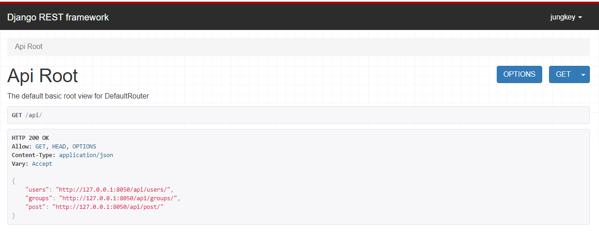
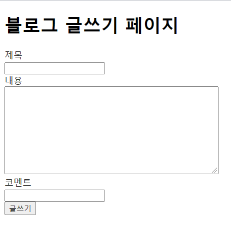

## 스터디 프로젝트 결과물 
1. Restful api 사용하여 간단한 블로그 만들기
2. Django FBV, CBV 이용하여 블로그 만들기
3. Django CBV 이용하여 todo List 만들기

## 1. Restful api 사용하여 간단한 블로그 만들기
Restful api 사용하여 블로그 기능 완성

## 2. Django FBV, CBV 이용하여 블로그 만들기
CRUD 기능있는 블로그 완성

## 3. Django CBV 이용하여 todo List 만들기
CRUD 기능있는 Todo List 완성
