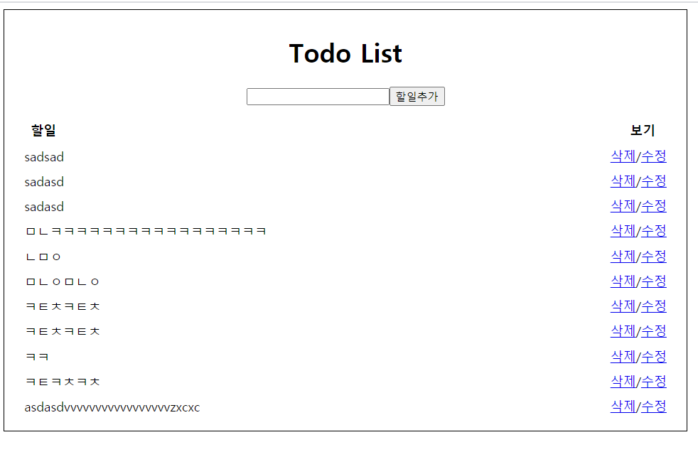

## 😀 스터디 프로젝트 결과물 
1. __Restful api 사용하여 간단한 블로그 만들기__
2. __Django FBV, CBV 이용하여 블로그 만들기__
3. __Django CBV 이용하여 todo List 만들기__

## 😀  Restful api 사용하여 간단한 블로그 만들기
__Restful api 사용하여 블로그 기능 완성__

## 😀 Django FBV, CBV 이용하여 블로그 만들기
__CRUD 기능있는 블로그 완성__ \

## 😀 Django CBV 이용하여 todo List 만들기
__CRUD 기능있는 Todo List 완성__
